Forest optimization
=======
基于HISM的三万颗树，动态创建instance（不烘培光照）

树模型
-------
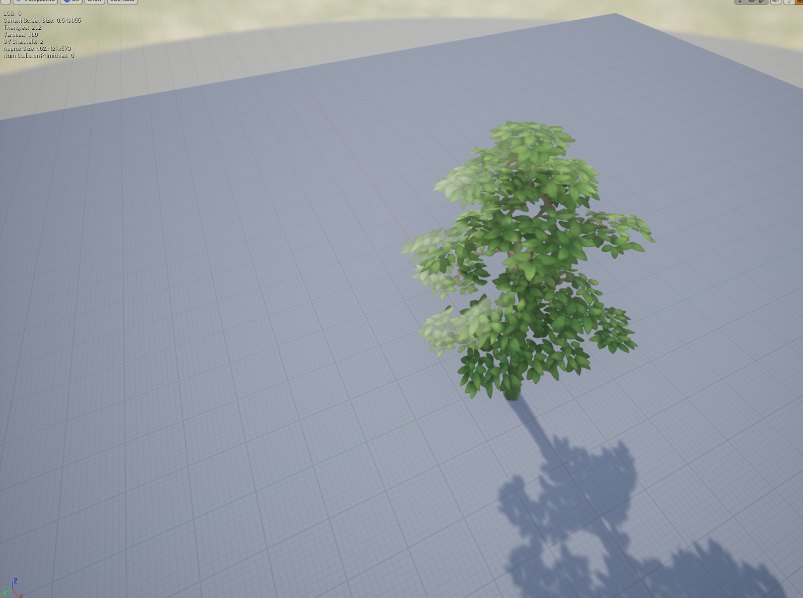
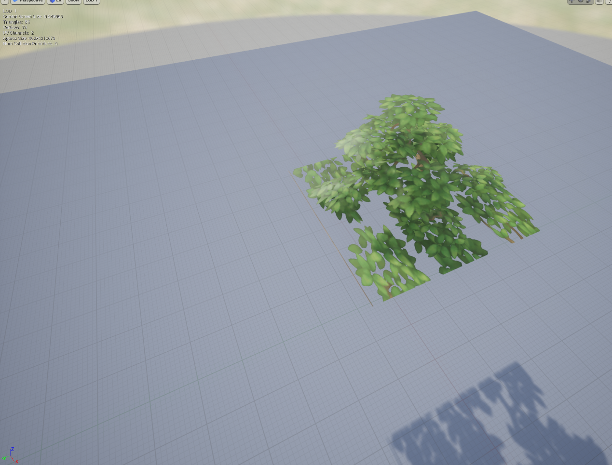

做的LOD1，高空时枝叶效果与LOD0类似，屏占比0.03时切换

### LOD效果
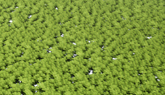
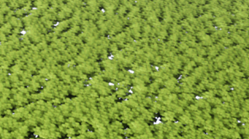

参数调整
---------
光源shadow cascade bias distribution设为0，让低级别阴影贴图的物体屏占比更小，使切换更平滑

效果
---------

### I7 10700 + 3060
FPS平均120左右

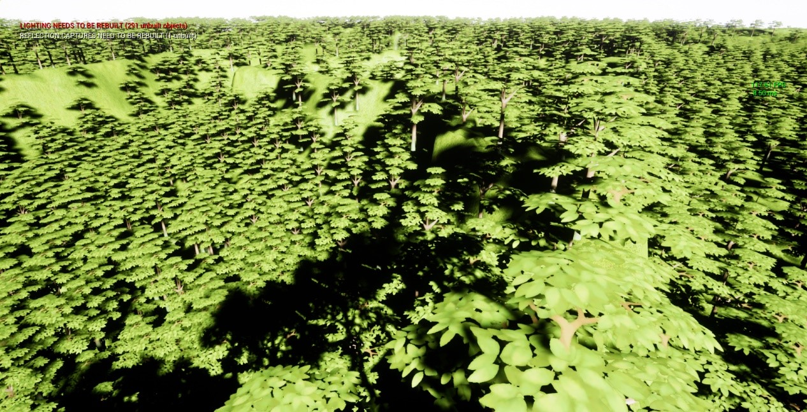
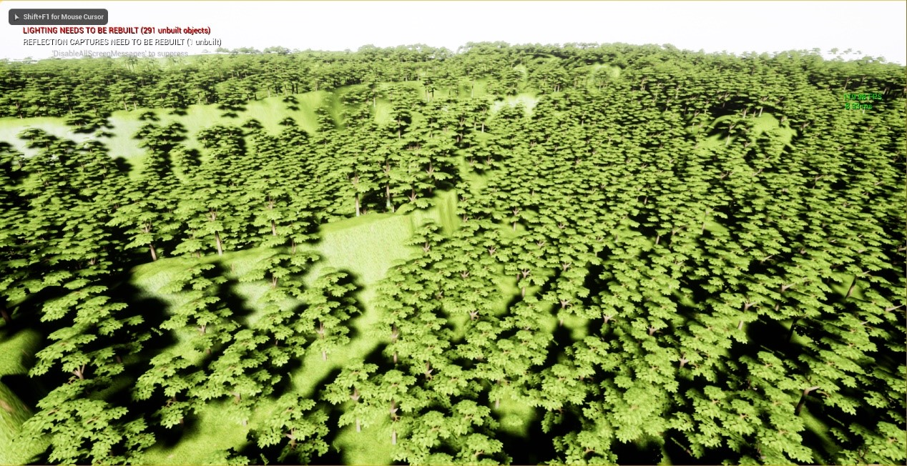
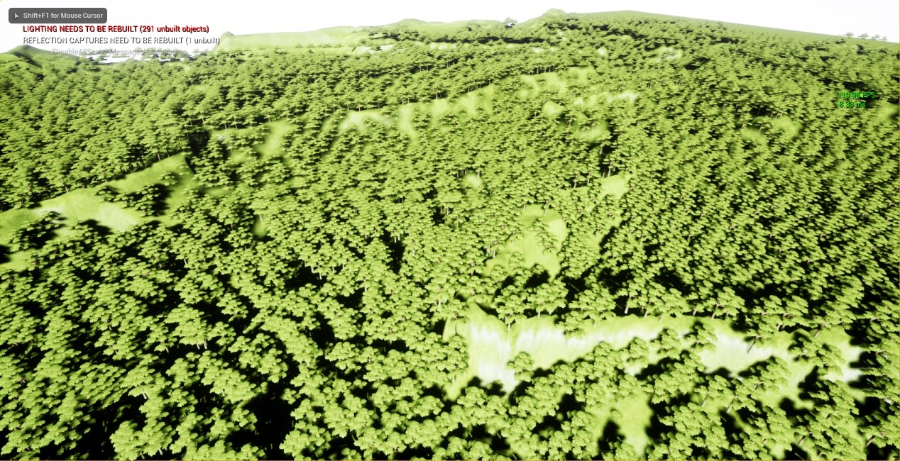

### I7 7700HQ + 1050ti
FPS平均50左右

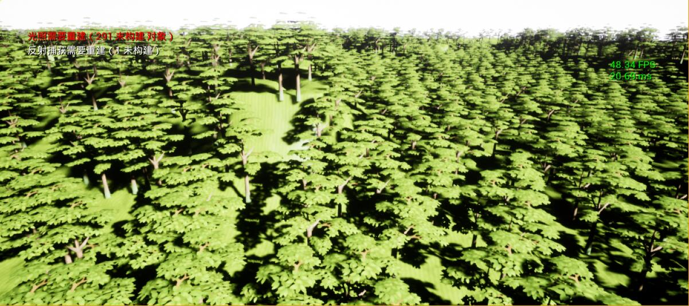
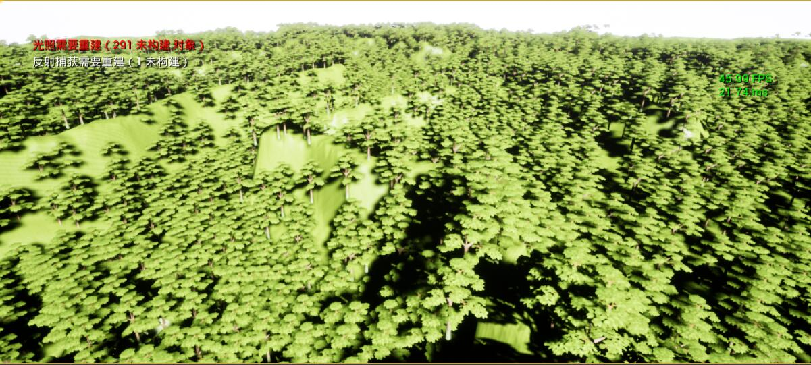
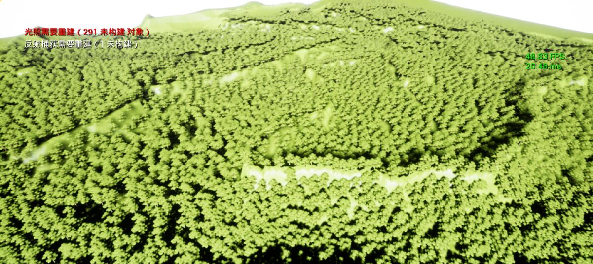

Profile
-----------

## sceneRendering
最终场景

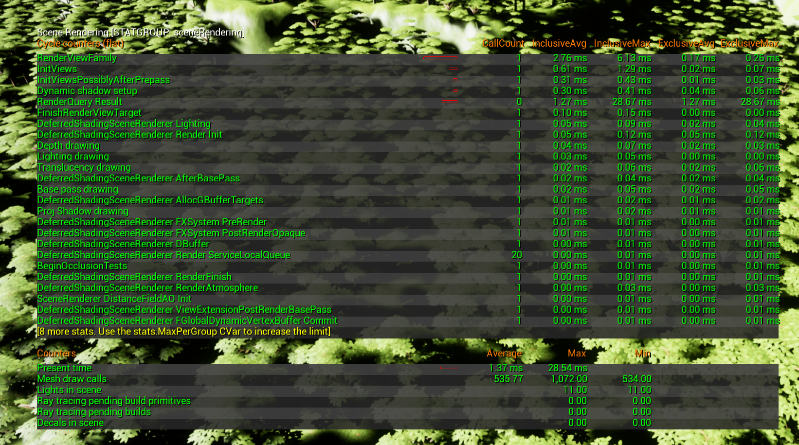

仅树

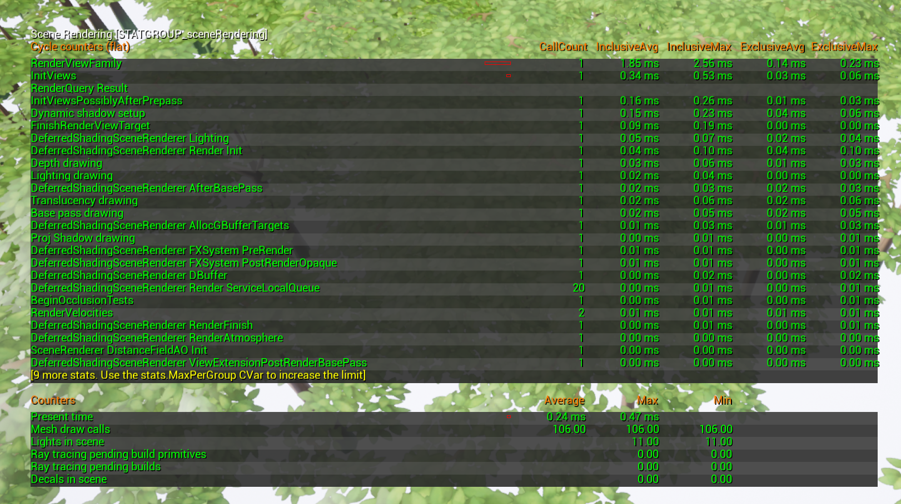

说明地形drawcall 400左右

## engine
最终场景

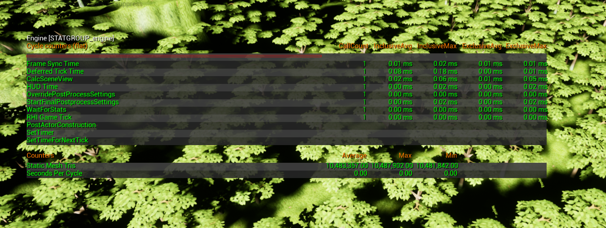

仅树

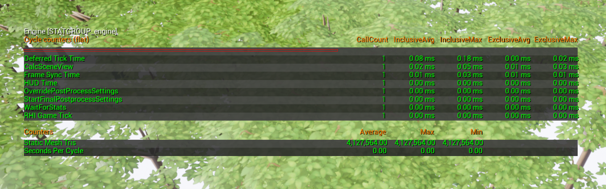

## session
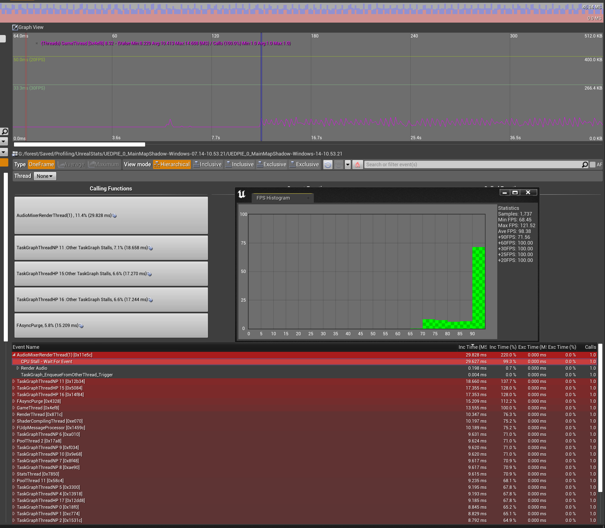

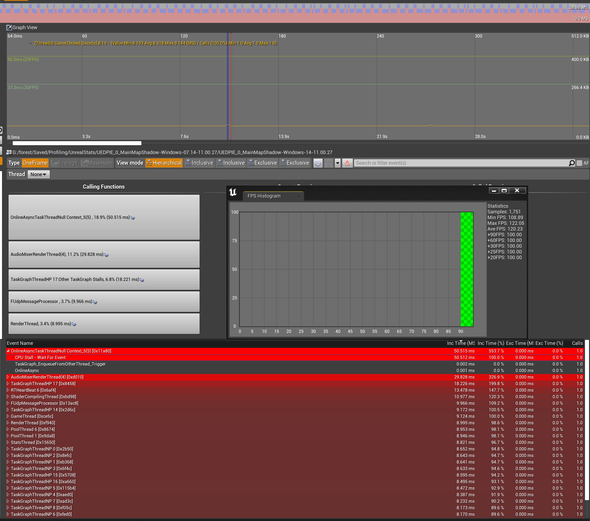

3060 4K全屏能提升5帧左右